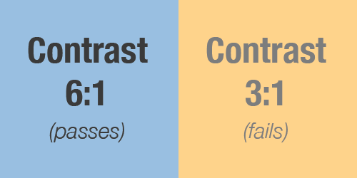
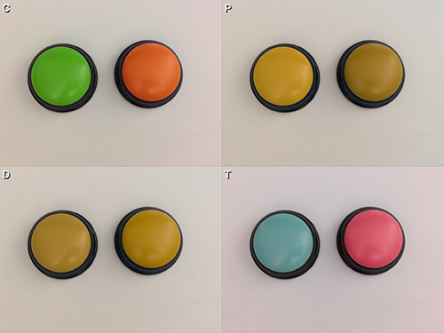
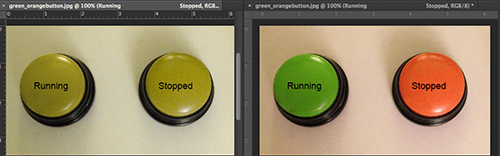

#Accessibility Guidelines

####TABLE OF CONTENTS
* [What is Accessibility?](#what-is-accessibility)
* [Why do we need to follow Accessibility guidelines?](#why-do-we-need-to-follow-accessibility-guidelines)
* [Which mobile applications do these guidelines apply to?](#which-mobile-applications-do-these-guidelines-apply-to)
* [What are the guidelines & standards we need to follow?](#what-are-the-guidelines--standards-we-need-to-follow)
* [How do we test to make sure our apps comply with Accessibility guidelines?](#how-do-we-test-to-make-sure-our-apps-comply-with-the-accessibility-guidelines)
* [What happens if we don't comply with the guidelines?](#what-happens-if-we-dont-comply-with-the-guidelines)
* [Is it possible to receive an exception to the guidelines?](#is-it-possible-to-receive-an-exception-to-the-guidelines)
* [Useful tips when designing and developing your application](#useful-tips-when-designing-and-developing-your-application)
* [Resources & additional information](#resources--additional-information)

##What is Accessibility?

Accessibility is all about **access**. It refers to the ability for everyone, regardless of disability or special need, to interact with the world around them. Specifically for mobile, it means that everyone, even those that suffer from vision or hearing loss, can interact with and benefit from our mobile application offerings.

##Why do we need to follow Accessibility guidelines?

There are two primary reasons we follow Accessibility guidelines:

####1. IT'S THE RIGHT THING TO DO.

Approximately [15% of the world's population](http://www.who.int/mediacentre/factsheets/fs352/en/) have some form of visual, motor, hearing or cognitive disability. We believe that optimizing mobile application content for utilization by all individuals, regardless of disability, raises the quality of service we provide our valued current and prospective patients. By enacting this standard, DaVita commits to a program of active resource investment in, and implementation of, current best practices with regard to the design and development of accessible native mobile application content.

####2. WE’RE REQUIRED TO BY LAW.

We are required to abide by the Americans with Disabilities Act of 1990 and support Section 508 of the Rehabilitation Act of 1973, as amended (29 U.S.C. 794d).

##Which mobile applications do these guidelines apply to?

These guidelines currently apply to all native, patient-facing mobile applications sponsored by DaVita. As regulations applying to mobile application accessibility evolve, the scope of these guidelines may change.

##What are the guidelines & standards we need to follow?
There are three primary standards we must follow for native mobile applications:

####1. COLOR CONTRAST

The color of background to color of type/icons must be at a minimum ratio of **6:1** (4:1 for large-scale text). This falls between the Web Content Accessibility Guidelines (WCAG) 2.0 Level AA contrast requirement of 4.5:1 (3:1 for large-scale text) and Level AAA contrast requirement of 7:1 (4.5:1 for large-scale text).

*An example of accessible (left) and inaccessible (right) color contrast ratios.*

Below is a summary of the Level AA and Level AAA Guidelines, however more information about the WCAG 2.0 Levels can be found [here](http://www.w3.org/TR/WCAG20/#visual-audio-contrast-contrast).

>**Level AA**:
The visual presentation of text and images of text has a contrast ratio of at least 4.5:1, except for the following:
* **Large Text**: Large-scale text and images of large-scale text have a contrast ratio of at least 3:1;
* **Incidental**: Text or images of text that are part of an inactive user interface component, that are pure decoration, that are not visible to anyone, or that are part of a picture that contains significant other visual content, have no contrast requirement.
* **Logotypes**: Text that is part of a logo or brand name has no minimum contrast requirement.

>**Level AAA**:
The visual presentation of text and images of text has a contrast ratio of at least 7:1, except for the following:
* **Large Text**: Large-scale text and images of large-scale text have a contrast ratio of at least 4.5:1;
* **Incidental**: Text or images of text that are part of an inactive user interface component, that are pure decoration, that are not visible to anyone, or that are part of a picture that contains significant other visual content, have no contrast requirement.
* **Logotypes**: Text that is part of a logo or brand name has no minimum contrast requirement.

####2. TEXT SIZE

Must be a minimum of 13pt, with the exception of legal, which may be 9pt.

You should also talk to your developer about coding for dynamic text in your application. This allows your application to respect the user's preferred font size as declared in the device's global settings.

####3. VOICEOVER (iOS ONLY)

Because [iOS is the platform of choice for visually-impaired mobile users](http://webaim.org/projects/screenreadersurvey5/#mobile), the VoiceOver guidelines apply to iOS native applications only. Apple provides, as part of their iOS platform, APIs which allow applications to be navigated by low- or non-sighted individuals using the built-in VoiceOver feature. Native iOS application content shall be designed to leverage VoiceOver for accessibility, in accordance with Apple Human Interface Guidelines best practices. The accessibility goal is to provide an easy, optimized VoiceOver navigation experience of native applications for low- and non-sighted individuals.

A comprehensive guide to developing iOS apps correctly for VoiceOver is available [here](https://github.com/dva-mcoe/general-documentation/blob/master/ui-ux-guide/ios_voiceover_development_guide.md).

##How do we test to make sure our apps comply with the Accessibility guidelines?

####TESTING COLOR CONTRAST RATIOS

To check the contrast of your colors, use a tool like the browser-based  [WebAIM Color Contrast Checker](http://webaim.org/resources/contrastchecker) or download the Paciello Group's free [Colour Contrast Checker](http://www.paciellogroup.com/resources/contrastanalyser/) application for Windows and Mac OS X.

There are also mobile applications that can simulate various vision impairments. Kazunori Asada's *Chromatic Vision Simulator* can be used to view three forms of colorblindness and is available for [iOS](https://itunes.apple.com/us/app/chromatic-vision-simulator/id389310222?mt=8) and [Android](https://play.google.com/store/apps/details?id=asada0.android.cvsimulator&hl=en). Also, the Braille Institute's *VisionSim* simulates several other low-vision conditions, along with causes & symptoms, and is also available for [iOS](https://itunes.apple.com/us/app/visionsim-by-braille-institute/id525114829?mt=8) and [Android](https://play.google.com/store/apps/details?id=com.BrailleIns.VisionSim&hl=en). Both of these apps allow viewing and saving similations through the device's built-in camera.

####TESTING VOICEOVER NAVIGATION

Functionality and native content shall be successfully tested using Apple VoiceOver prior to application submission to the Apple App Store. Project teams will coordinate native content accessibility compliance UI/UX reviews with the Mobile Community of Excellence (MCoE) as part of the DaVita mobile application certification process.

##What happens if we don’t comply with the guidelines?

Because we are required by law to follow these guidelines (and because it's the right thing to do), there are precautions we must take before a mobile application is submitted to the Apple App and Google Play Stores

####LOGGING DEFECTS

During the normal User Acceptance Testing (UAT) process as part of the application development lifecycle, if areas, content or elements of the application are found to not be compliant with the Accessibility guidelines, defects should be logged and fixed by the design and development teams as soon as possible.

####FAILING CERTIFICATION

If an application is submitted to the MCoE to be certified and is not compliant with the Accessibility guidelines, the application will not be certified and cannot launch.

##Is it possible to receive an exception to the guidelines?
Exceptions to the Accessibility guidelines shall require a waiver approved by the Senior Director of the Mobile Community of Excellence and the Justice League of DaVita (JLD).

##Useful tips when designing and developing your application

* **Color should never be used as the primary identifier in a user interface.** For example, instead of using green, yellow and red colors to identify the status of a patient’s health reminder, other labeling or accessible iconography should be used so that a colorblind or otherwise vision-impaired user can still scan the list of reminders and easily identify the status.

*Using the Chromatic Vision Simulator mobile app, the green and orange buttons show normal (C) vs. protanope (P), deuteranope (D) and tritanope (T) color vision deficiencies.*

*Adding labels instead of relying on color alone will ensure design elements are accessibile to vision-impaired users.*

* **Gradients require special attention.** If grayscale or color gradients are used in your design, be sure that the color contrast ratio passes for the foreground and background on both the lightest and darkest part of the gradient.

* **Avoid embedding text into static images.** When text is part of a flattened, static image, screen readers such as VoiceOver for iOS are unable to distinguish the text from the image and cannot communicate it to the user.

* **Accessibility should be built into your application from the beginning, not tacked on as an afterthought.** Waiting until the end of your design and development process will put your application launch deadline at risk, which may include failing to pass the MCoE's certification process.

* **Incorporate accessibility into the timeline.** Both internal project plans and third-party vendor Statements of Work (SOW) should include an appropriate budget limit, amount of time and number of resources dedicated to fixing any accessibility defects before the app is launched, discovered after launch or defects that have been given an exception via a waiver. The end date for a SOW should include sufficient time after the application launch date to account for the fixing of accessibility defects.

##Resources & additional information

####GENERAL INFORMATION

* [Americans with Disabilities Act](http://www.ada.gov/)
* [ICT Standards and Guidelines Advance Notice of Proposed Rulemaking](http://www.access-board.gov/sec508/refresh/draft-rule.pdf)
* [Web Content Accessibility Guidelines (WCAG) 2.0](http://www.w3.org/TR/WCAG/)
* [Mobile Accessibility](http://www.w3.org/WAI/mobile/)

####ACCESSIBILITY FOR iOS

* [iOS Accessibility for Apple Developers](https://developer.apple.com/technologies/ios/accessibility.html)
* [Introduction for iOS Developers](http://mattgemmell.com/accessibility-for-iphone-and-ipad-apps/)
* [Web Accessibility Best Practices for iOS](https://www.webaccessibility.com/best_practices.php?technology_platform_id=222)
* [Accessibility Programming Guide for iOS](https://developer.apple.com/library/ios/documentation/UserExperience/Conceptual/iPhoneAccessibility/Making_Application_Accessible/Making_Application_Accessible.html#//apple_ref/doc/uid/TP40008785-CH102-SW6)
* [On Touch ID & Accessibility](https://medium.com/@steven_aquino/on-touch-id-and-accessibility-eff1391cff91)
* [On Apple Pay & Accessibility](http://stevensblog.org/apple-pay-rejections/)

####ACCESSIBILITY FOR ANDROID
* [Accessibility Programming Guide for Android](https://developer.android.com/guide/topics/ui/accessibility/index.html)
* [Web Accessibility Best Practices for Android](https://www.webaccessibility.com/best_practices.php?technology_platform_id=286)

---

**Updated:** December 2014
