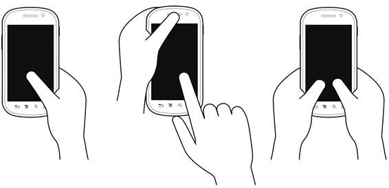

#The mobile design process
Before diving into [setting up your design files](https://github.com/dva-mcoe/general-documentation/blob/master/ui-ux-guide/setting_up_design_files.md), it's imperative to have a clear understanding of why you are building your application, who you are designing it for, how you are meeting the specific needs of your audience and the inherent challenges & opportunities that come with designing for mobile devices. This document provides an introduction to each of these areas with the goal of helping you build a strong foundation for your application and ultimately ensure its usability, adherence to platform-specific guidelines, consistency in relation to other apps and, hopefully, its raging success after passing the DaVita MCoE's Certification process.

Keep in mind that when we talk about "design," we are referring to both what a user sees and how they are able to interact with a mobile application. As Steve Jobs famously said, "Design is a funny word. Some people think design means how it looks. But of course, if you dig deeper, it's really how it works."

####TABLE OF CONTENTS
* [Finding your purpose](#finding-your-purpose)
* [Understanding your audience](#understanding-your-audience)
* [Research objectives](#research-objectives)
* [Rational design decisions](#rational-design-decisions)
* [Common design deliverables](#common-design-deliverables)
* [The Mobile First Design Philosophy](#the-mobile-first-design-philosophy)
* [Using standard gestures, UI elements & patterns](#using-standard-gestures-ui-elements--patterns)
* [Take advantage of the device](#take-advantage-of-the-device)
* [Testing your application](#testing-your-application)
* [Resources & additional information](#resources--additional-information)

##Finding your purpose

When taking into account the hundreds of thousands of mobile applications available, you might notice that the most successful apps have a few common characteristics:

* **Delightful & easy to use**
* **Beautifully designed**
* **A clear purpose or task**

One could argue that the three characteristics above cannot exist without each other. For example, an app that presents a clear purpose (i.e. a calculator app) that has a clunky interface, a jarring color scheme and constantly crashes will probably be quickly uninstalled or passed over in favor of other calculator apps. On the other hand, even if an app is easy to use and exquisitely designed, if it serves no clear purpose or provides any value, users will probably not be motivated to use it more than once or twice.

If you have a great idea for an app, a good questions to ask is, **"what problem is this app going to solve?"** A "problem" may not be a problem in the traditional sense, but rather a problem that your users don't even know is a problem yet. Henry Ford was known to have said, in reference to transforming automobiles into an affordable commodity, "If I had asked people what they wanted, they would have said faster horses.”

At the beginning of the mobile design process, it's important to understand what your app is trying to accomplish and why it's going to bring value to your users. A good exercise is to summarize the purpose of your app in one sentence, like so:

**_(Your differentiator) (Your solution)_** *for* **_(Your audience)._**

In the case of Henry Ford, his sentence may have looked like this:

**_(Affordable) (motorized transportation)_** *for* **_(middle class Americans)._**

In the kidney care space, for example, a problem may be identified as "doctors are spending too much time tracking down important information about their patients and are not able to provide care as quickly as they would like." With this problem in mind, a team might propose building an app that would provide:

**_(Comprehensive) (patient data accessible from any mobile device)_** *for* **_(nephrologists and their staff)._**

####SKATE TO WHERE THE PUCK IS GOING TO BE

As you're identifying the primary problem to be solved with your mobile application, don't forget to think beyond just the one problem. Through extensive research and interviews with current and potential users of your application, you'll want to plan for how your app will grow over time and lay the groundwork for those improvements and innovations. As Wayne Gretzky said, "I skate to where the puck is going to be, not where it has been."

##Understanding your audience

A common mistake app development teams make is deciding to build an app before determining that there is an actual audience, need or purpose for the app. One could argue that the audience is far more important than the app itself. If there's no identified audience for the app, then there won't be much of a demand for the app — and perhaps there shouldn't be an app at all. Identifying your audience first (and what their needs are) means that there's a much greater chance that the features and functionality you implement into your app will actually make sense and be useful.

In the example above (creating an app that provides comprehensive patient data accessible from any mobile device for nephrologists and their staff), the audience has been targeted (nephrologists and their staff), but we need to have a better understanding of how they currently round up patient data. In particular, we want to know where the [pain points](http://pointsandfigures.com/2012/04/27/whats-a-pain-point/) are by conducting thorough research in the form of interviewing nephrologists and their staff, in person whenever possible. We want to understand what it's like in their shoes; to understand what works really well today and  where the struggles are, either real or perceived. Having this kind of insight and developing **empathy** for our users will help us create an app that will have the most value for our audience and make them feel like they were included and listened to as part of the app development process.

##Research objectives
Establishing a strong purpose for your app and an accurate portrait of your app's audience can only be achieved through **research**. Below are a few approaches and data types you will want to gather before and during your app development process. Even after the first version of your application is launched, remember that it is a living, breathing application and will need to be updated and grow as business and user needs change & evolve over time.

####EMPATHIC DESIGN

[Empathic Design](http://en.wikipedia.org/wiki/Market_research) is an approach based on [user-centered design](http://en.wikipedia.org/wiki/User-centered_design) and is focused on observing actual (or potential) users of your product and then interpreting those observations to ultimately build a better product that is not based solely off the app design team's assumptions. This is a great way to be inclusive of your audience from the very beginning of the design process.

####MARKET RESEARCH

[Market Research](http://en.wikipedia.org/wiki/Market_research) is a fairly traditional, yet important piece of the puzzle when designing any product, including mobile applications. Casting a wider net than empathic design, market research uses analytics and other data (including user surveys) to look at competitors and make decisions around a product's place in the market.

Specific to mobile apps, it's essential to become familiar with apps that may compete with the app you are developing. Is there an app already out there that serves users almost exactly the same way you envision your app will? Do some of your potential users already use this other app? If so, how will your app be different and better serve the needs of your users?

####DEMOGRAPHICS

As part of your research, you will want to capture certain **demographics** about your audience, which will have a big impact on how you approach the design and functionality of your app. Demographic data points include age, gender, location, language, employment status, and more. Specific to mobile apps, this should also include mobile platform use. For example, does your audience primarily use iOS or Android devices, or both?

######MORE ON LANGUAGE & LOCALIZATION

As DaVita continues to expand its operations throughout the world, it will become more critical to offer our products & services in multiple languages, also known as **localization**. In addition to language, there are other elements of localization that we need to consider. Does the audience in a certain area read left-to-right or right-to-left? Are there certain technological constraints unique to an area? Are there cultural sensitivities that we need to be aware of? Does the tone or "voice" of our content need to be different for a certain audience? Make sure to engage early and often with teammates that are part of the international audience you are designing for.

####CONTEXT

**Context** refers to how and where your audience will typically be using your app. Is your audience largely physicians using tablet devices in a bright, fast-paced hospital environment or patients on smaller devices in clinics or at home? The best way  to determine context is through in-person observations and interviews.

**Important Note:** There is still a general assumption that mobile device users are "on the go" and will not need the ability to do certain actions on their mobile devices, such as filling out forms or changing settings. Several studies reveal that more and more of the population expects to be able to do everything on their mobile devices that they'd be able to do on their desktop or laptop computers (more information in [The Mobile First Design Philosophy](#the-mobile-first-design-philosophy) section below).

##Rational design decisions

After completing your initial research objectives and begin sketching out ideas for your application, remember to have a clear reason behind every design decision. When you begin presenting your application to various stakeholders, you will undoubtedly be asked questions such as, "why did you do it this way instead of that way?" or "why are you using that color?" Being able to answer these questions with a solid reason (hopefully based on research) instead of saying, "because it looks good," will build your credibility as an app designer and help you make logical decisions as you face different design challenges throughout the app design process.

####LEVERAGING BRAND ATTRIBUTES

When designing an app that is tied to a specific company or corporation such as DaVita, it's important to make sure you are  following DaVita's [Brand Guidelines](http://villageweb.davita.com/go/?id=73930). Because an app representing or being sponsored by a company will be a direct reflection of that company, brand guidelines should not be tacked on at the end of app design process, but integrated from the very beginning. Not following brand guidelines can result in failing the Mobile Community of Excellence's (MCoE's) Certification process.

######WHITE-LABELING

Just as important as integrating brand guidelines is knowing when and how a certain brand should not be communicated to end users. If you are creating an app that will be sold and branded by its purchasers, you are creating a **white-labeled** product. As a DaVita teammate creating a white-labeled mobile application, you will want to be sure the app not have any ties to the DaVita brand, unless there are specific business requirements to do so.

##Common design deliverables

As new design techniques and software continue to evolve and change, there is constant debate around what approaches or perfect suite of software teams should use to design and develop mobile applications. Rather than prescribe what we think is best, our advice is to figure out what works best for your team, your business stakeholders and, ultimately, your end users.

One thing you'll want to determine is how prescriptive and exact your design deliverables need to be. This may depend on how closely you are working with your developers (which is hopefully very close), and how many designers are working on your app. Being too exact with your deliverables can create just as many problems as not being exact enough, so be sure to find the right balance that works for your team and supports your goal of providing an outstanding mobile application to your users.

That said, here are descriptions & examples of common design deliverables along with some resources you may find helpful.

####WIREFRAMES

The purpose of wireframes is to communicate the user flow and/or **interaction** of your application *(see Fig. 1 below)*. It is not meant to convey visual design or the correct editorial that will be used in your app. Usually, wireframes are created in grayscale and incorporate"callouts" to describe different interactive elements along with simple placeholders for elements such as images, icons and text (also called "Greek copy"). Using placeholders allow both the designer and stakeholders to focus on just the interaction without getting caught up on the visual or editorial components.

*Fig. 1 – An example of mobile wireframes with callouts for interactive elements ([view larger version](images/wireframes_example_large.png)).*

**Pros:** Allows for rapid & iterative design since attention to small design details is not needed. Helps communicate interaction.

**Cons:** Can be difficult to communicate interaction through static wireframes, especially for those that are not savvy mobile device users. Can be problematic, especially for developers & testers, when trying to sync changes between wireframes and visual comps.

**Suggested Software:** [Sketch](http://bohemiancoding.com/sketch/), [Adobe Illustrator](http://www.adobe.com/products/illustrator.html), [OmniGraffle](https://www.omnigroup.com/omnigraffle), [Adobe InDesign](http://www.adobe.com/products/indesign.html), [Balsamiq](http://balsamiq.com/), [Axure](http://www.axure.com/).

####VISUAL COMPS & STYLEGUIDES

Visual comps communicate the **visual appearance** and design of an app with special focus on colors, imagery, icons, textures, typography, spacing, layout and other brand-related design elements. Comps are not meant to convey specific interaction or the correct editorial that will be used in your app. Historically, designers have created visual comps to represent every detail that should be included in each screen of the app, along with a secondary **visual styleguide** document that calls out specific color hex values, font sizes, spacing, design patterns, etc., for the developer to reference.

**Pros:** Provides exact designs for stakeholders and other team members to react to. Can also be used for various marketing materials and other communications.

**Cons:** Can be very time-consuming to update. Is not necessarily an effective approach when designing for multiple screen sizes. Can be problematic, especially for developers & testers, when trying to sync changes between visual comps and wireframes.

**Suggested Software:** [Sketch](http://bohemiancoding.com/sketch/), [Adobe Illustrator](http://www.adobe.com/products/illustrator.html), [Adobe Photoshop](http://www.adobe.com/products/photoshop.html).

####STYLE TILES

[Style Tiles](http://styletil.es/) take a different approach on  traditional visual comps by providing more open design guidelines, with the assumption that designers are paired very closely with developers *(see Fig. 2 below)*. Instead of providing comps of each and every screen, designers create a document that lies somewhere between a mood board and detailed comps, providing enough (but not too much) design direction for developers.

*Fig. 2 – An example of a Style Tile that would be approved by stakeholders and delivered to developers.*

**Pros:** Allows for rapid design and the ability to present different concepts. Changes and updates can be made quickly. Allows stakeholders to approve the overall feel & tone of a design without getting hung up on small design details. May help establish a closer working relationship with developers, if not already present.

**Cons:** May be too vague for some stakeholders and developers. Requires a very close working relationship with developers, which may not be feasible.

**Suggested Software:** [Sketch](http://bohemiancoding.com/sketch/), [Adobe Illustrator](http://www.adobe.com/products/illustrator.html), [Adobe Photoshop](http://www.adobe.com/products/photoshop.html) (templates are available on the [Style Tiles](http://styletil.es/) website.)

####INTERACTIVE PROTOTYPES

**Interactive prototypes** have a wide range of uses and some app design teams have found them to be more effective than both wireframes and visual comps combined. Prototypes can be an incredibly effective communication tool because a designer, stakeholder or other team member can actually use and see this representation of the app in action instead of trying to imagine what the final product will look like or how it function based on static wireframes and comps.

Not only will building a prototype help the designer discover interactions that may not have been accounted for in static wireframes, prototypes can also be distributed for testing purposes early on in the design process to gauge how effective the user experience is. In addition to creating standalone prototypes, designers can also work closely with developers to push out test application builds that users can download and test on their own (or loaned) devices.

**Pros:** Excellent way to communicate how an application will look and function, especially to an audience that is not savvy in mobile applications. A great way to demo potential capabilities to garner buy-in. Can be used for testing purposes. Depending on software used, can be very quick to update.

**Cons:** May be time-consuming to build. May not be able to provide enough direction to developers. Can be challenging to cover all necessary visual, interactive and editorial requirements.

**Suggested Software:** [InVision](http://www.invisionapp.com/), [proto.io](https://proto.io/), [Axure](http://www.axure.com/).

####EDITORIAL DOCUMENT

An **editorial document** is used to capture all the content and other editorial that will be used in a mobile application, including error messages, button labels, accessibility text (especially for [VoiceOver on iOS](https://github.com/dva-mcoe/general-documentation/blob/master/ui-ux-guide/ios_voiceover_development_guide.md)), and legal/disclaimer copy.

**Pros:** Provides one repository for all content that developers, testers, stakeholders and other team members can access. Can be easily sent to stakeholders for review and approval. Allows for quick updates and changes.

**Cons:** Can be problematic, especially for developers & testers, when trying to sync changes between wireframes and visual comps.

**Suggested Software:** [Atom](https://atom.io/) (for writing in [Markdown](http://en.wikipedia.org/wiki/Markdown) language and hosting on [GitHub](https://github.com/)), [Microsoft Word](http://products.office.com/en-us/word), [Microsoft Excel](https://products.office.com/en-us/excel).

*Please note that hosting Markdown documents on Github has built-in versioning while Microsoft Word & Microsoft Excel must have "track changes" turned on manually.*

##The Mobile First Design Philosophy

According to the latest statistics from Pew Research, **90% of American adults have a cell phone**, 63% of which use their cell phones to go online and 34% of which use their cell phone as their primary device to access the internet. Even though [these statistics](http://www.pewinternet.org/fact-sheets/mobile-technology-fact-sheet/) are primarily looking at mobile web use vs. mobile app use, it paints a pretty clear picture of how embedded mobile devices are in our lives. Mobile users can no longer be classified as "on the go" or only needing access to limited feature sets. These days, users expect to do everything on their mobile devices that they'd be able to do on a typical desktop or laptop computer.

The **Mobile First Design Philosophy,** developed by user experience guru [Luke Wroblewski](http://www.lukew.com/resources/mobile_first.asp), explains why design teams should start their designs with mobile (or small screens), instead of starting with large screens and leaving the mobile designs for last. This approach is most often applied to responsive web sites that need to work across different screen sizes, but many of the same principles can apply to mobile applications, especially if teams are building both mobile & tablet apps, and if there is a companion website that gives users access to some of the same functionality.

*Fig. 3 – An excellent visual representation of the Mobile First Design Philosophy from [Brad Frost](http://bradfrost.com/blog/web/mobile-first-responsive-web-design/)*.

One of the big advantages of implementing the Mobile First Design Philosophy is that it forces teams to think in terms of mobile users, who are usually looking at fairly small screens, use their fingers to interact with the screen and will probably not want to spend time reading a lot of text on that small screen. If teams can pare down their design to what really matters and works well for mobile users, they will be setting themselves up for success when it comes to translating the same design to larger screens, if necessary.

####DESIGNING FOR TOUCH

Perhaps the most notable difference between using a typical desktop or laptop computer and mobile devices is that we use our fingers to interact with mobile devices, not mice. It's a helpful exercise to start using the correct language, such as "tap" instead of "click." For example, you would not want to use verbiage such as "click here" in your mobile applications or hard-to-tap underlined links that are optimized for mouse cursors, not fingers (more insights under "Affordances and Metaphors" below).

You will also want to understand how users typically hold various mobile devices, where the "thumb zones" are and how reachable your UI elements are for users' fingers in general *(see Figs. 4a, 4b, 5a & 5b)*. Along with understanding how *most* users hold different devices, you will most certainly want to personally observe how your users interact with your application on various devices.

*Fig. 4a – The "thumb zones" for most smartphones*.

*Fig. 4b – How typical users hold and interact with their smartphones*.

*Fig. 5a – The "thumb zones" for most tablets*.

*Fig. 5b – How typical users hold and interact with their tablet devices*.

####DESIGNING FOR CONTEXT

Designing for context is equally as important as designing for the devices themselves. **Context** can drive certain design decisions such as the layout of the UI for different devices, how the navigation is organized or what information shows up at the top versus the bottom of the screen. As mentioned before, we don't want to rush to any conclusions about what our users will want to do on their devices, or consider that our users will only be "on the go" when using the app, but we can find out what might be most important to users depending on what device they're using.

For example, an amusement park has roughly the same functionality and content available on both their website and mobile app. The design team found that mobile device users usually wanted to see traffic and weather reports since they were often launching the app when they were about to leave their home or in the car on the way to visit the amusement park. Since the design team understood the context in which their users were using the mobile app, they were able to organize the content to make the app even more helpful and useful.

##Using standard gestures, UI elements & patterns

We all want our app to be unique and different from all the other apps out there, but we also don't want our app to be so wildly different that our users will find it confusing and frustrating to use.

With the exception of most game-focused apps, users have certain expectations, based on past experiences, of how they should be able to interact with apps. It's important to strike a balance between working with what your audience already knows, making it easy to update and maintain your app, and ensuring your app stands out from the crowd. In most cases, we suggest sticking to standard design patterns and gestures, but don't dismiss the idea of building custom design patterns if it will be in the best interest of your users.

####PLATFORMS

While we don't want to be completely prescriptive when it comes to the design of your app, it is essential for your users (and to pass MCoE's Certification process) that your app is properly designed for the platform(s) it will be available on (iOS and/or Android).

If your app will be available on both iOS and Android, your app must be designed explicitly for each platform. An iOS app design cannot simply be ported over to Android and vice versa. You will want to become intimately familiar with Apple's [Human Interface Guidelines (HIG)](https://developer.apple.com/library/ios/documentation/UserExperience/Conceptual/MobileHIG/#//apple_ref/doc/uid/TP40006556-CH66-SW1) and Google's [Android Design Guidelines](https://developer.android.com/design/index.html) to make sure that you are following the most essential design principles unique to each platform.

####A NOTE ON ICONOGRAPHY
Icons can be a great design element to communicate certain functionality, not to mention add eye candy to your app's UI. However, the use of icons should be approached with caution. Make sure you are only using iconography that is either standard to the device's operating system or approved by DaVita's Brand & Marketing teams. Also, it may be necessary to pair icons with labels so that users will have a clear understanding of the functionality or information represented by the icon.

####AFFORDANCES AND METAPHORS
An **affordance** is a perceived signal or clue that an object may be used to perform a particular action. For example, a doorknob is about the size of a human palm, visibly sticks out from a door and allows room for fingers to wrap around it, so it affords gripping, turning, pushing and/or pulling. A door that only opens in one direction may have a handle on one side (affords pulling) and a metal plate on the other side (affords pushing). Objects may have **explicit** and **hidden** affordances. A chair's explicit affordance is sitting while its hidden affordance may be to break a window when trying to escape a burning building.

These affordances found in our everyday environments can (and should) make their way into our mobile application designs. Such affordances and **real-world metaphors** will help your users more quickly understand how to interact with your application, especially for first-time users. For example, since your users will be using their fingers to interact with your app, using buttons that look like buttons and are appropriately sized for fingers versus using small underlined links will provide an adequate target and help your users understand that they may tap the button and something will happen. The label on the button can more explicitly inform the user what will happen when they tap the button.

There was quite a bit of criticism when Apple redesigned many of the operating system's UI elements in iOS 7. For example, buttons no longer looked like buttons and only consisted of text labels. These buttons lost the affordance of being tappable for many users. Later on, Apple added a setting that allowed users to make text-based buttons have button-like outlines and shapes.

Just as using too few affordances can cause usability issues, so can the overuse of affordances & real-world metaphors. Is it necessary to use a knob element to control volume (which may be difficult to interact with on a mobile screen) or would a slider suffice since its functionality would be very similar to how it's used in other mobile applications? Be sure to take advantage of new mobile design patterns, but not stray so far away from affordances and real-world metaphors that your users will find it difficult to use your application. And always remember that you are designing for fingers and not mice!

##Take advantage of the device

One of the primary reasons to build a native mobile app is to take full advantage of the devices' features and functionality. While mobile websites can take advantage of some device features, such as the built-in camera, native applications can integrate push notifications, Touch ID (for iOS), PIN codes or Passcode Lock for authentication, bluetooth, both standard & custom gestures, built-in gyroscope, GPS, accelerometer, compass, integration with other native applications like the Contacts app, and more.

Be sure to incorporate native device functionality whenever possible to improve the overall user experience of your app.

##Testing your application

One of the most vital processes you need to include in your mobile design process is **user testing**. That is, observing actual users use your application in all stages of the design process, or as we like to say, "early and often."

There are a variety of user testing techniques and tools available to you. Remember, it doesn't have to be a serious and formal affair. Some testing is always better than no testing, but it's preferable to have some kind of concrete testing plan.

####HEURISTIC EVALUATIONS

The most basic resource you and your team can look at before involving real users are a set of **heuristics**, which is basically a set of general rules your mobile app should follow. Jakob Nielsen published [10 Usability Heuristics for User Interface Design](http://www.nngroup.com/articles/ten-usability-heuristics/) in 1995 that you can reference. Another article, [Empirical Development of Heuristics for Touch Interfaces](http://www.uxmatters.com/mt/archives/2014/06/empirical-development-of-heuristics-for-touch-interfaces.php), was published more recently and looks more specifically at mobile devices. Keep in mind that heuristics are sometimes *too* general and have the potential to lead your design astray, so they should never be the only reference used to test your app.

####FIELD TESTS, INTERVIEWS & REMOTE TESTING

The best possible user testing technique is in-person observation of your users in the actual environment where they would typically be using your app, also called **field studies**. Secondary to field studies would be in-person usability tests or remote tests using a tool like [usertesting.com](http://www.usertesting.com/). In all cases, your team needs to figure out ahead of time who your target audience is for the app and recruit participants appropriately. Having some kind of script or tasks that you want participants to complete will help you make the most out of your testing sessions, and don't forget to keep organized notes.

You will want to ask your participants to give feedback out loud the entire time they are testing your application. Ensure them that their feedback will not hurt your feelings and there is no right or wrong answer. Also, some type of compensation (such as gift cards) will let your participants know that you appreciate their time.

A great article, [Starting Your User Research](http://www.uie.com/articles/starting_user_research/), was published by Jared Spool and goes over the different testing techniques above (and more) in greater detail. To hear about other techniques specific to user research for mobile, check out [this podcast](http://www.uie.com/brainsparks/2014/12/17/cyd-harrell-techniques-for-mobile-research/) featuring Cyd Harrell (transcript available).

####AFTER THE TEST

There is no doubt you will learn a lot from your user testing, perhaps confirming that parts of your design are working well (or not). From your detailed, organized notes that were taken during the testing sessions, it's time to sort through them and create a **debrief document**.

The debrief document should give a summary of your participants (how many there were, their occupations, ages, gender, and other important demographics), how the test was conducted, and what was asked of the participants. You'll then want to get into the actual results. Focus on the things that worked really well and really not-so-well. If only one of your testers had a difficult time with a portion of the test, it's probably not a significant issue. However, if only one of your testers was able to successfuly complete a certain part of the test, there is most likely a problem that needs to be addressed. The debrief document should be sent to all members of the app design team and the appropriate stakeholders.

During your test, your participants will be giving a lot of feedback, and may even have suggestions on how to fix what they believe isn't working well. Although your participants may have some great ideas, keep in mind the following quote from auther Neil Gaiman, “When people tell you something’s wrong or doesn’t work for them, they are almost always right. When they tell you exactly what they think is wrong and how to fix it, they are almost always wrong.” Be sure to entrust your design team with finding solutions to usability issues, and then test again!

##Resources & additional information

* [Apple's Human Interface Guidelines (HIG)](https://developer.apple.com/library/ios/documentation/UserExperience/Conceptual/MobileHIG/#//apple_ref/doc/uid/TP40006556-CH66-SW1)
* [Google's Android Design Guidelines](https://developer.android.com/design/index.html)
* [10 Usability Heuristics for User Interface Design](http://www.nngroup.com/articles/ten-usability-heuristics/)
* [Empirical Development of Heuristics for Touch Interfaces](http://www.uxmatters.com/mt/archives/2014/06/empirical-development-of-heuristics-for-touch-interfaces.php)
* [Mobile First Design Philosophy](http://bradfrost.com/blog/web/mobile-first-responsive-web-design/)
* [Starting Your User Research](http://www.uie.com/articles/starting_user_research/)

---

**Updated:** January 2015
