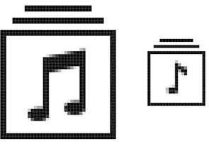
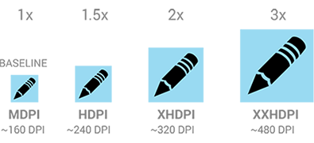
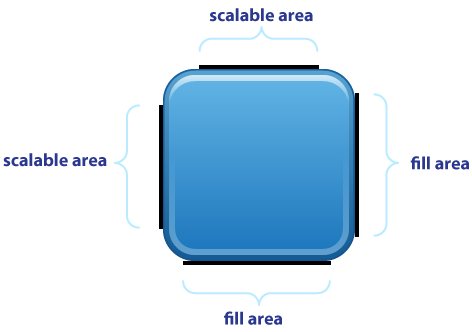
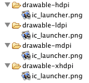

#Setting up design files

Now that you're familiar with the [mobile design process](https://github.com/dva-mcoe/general-documentation/blob/master/ui-ux-guide/mobile_design_process.md), it's important to understand the platforms and operating systems that DaVita currently supports and how to set up your design documents appropriately. You'll also want to plan for the required design assets that are needed to pass the DaVita MCoE's Certification process.

####TABLE OF CONTENTS

* [Supported platforms & operating systems](#supported-platforms--operating-systems)
* [Working with vector graphics](#working-with-vector-graphics)
* [Recommended design tools](#recommended-design-tools)
* [Designing for iOS](#designing-for-ios)
* [Designing for Android](#designing-for-android)
* [Writing Release Notes](#writing-release-notes)
* [Resources & additional information](#resources--additional-information)

##Supported platforms & operating systems

For both internal- and external-facing applications, DaVita currently supports the following platforms and minimum operating system versions:

* **iOS**
  * iOS 7 and higher
* **Android**
  * 4.0 (Ice Cream Sandwich) and higher

##Working with vector graphics

It is highly recommended that you work with vector graphics and not raster (bitmap) graphics, except for photography. While **raster** graphics are made up of pixels at a fixed resolution and resizing them (especially enlarging) will have an adverse affect on image quality, **vector** graphics are not made of pixels and can be infinitely scaled. The most common type of raster graphics are photographs while the most common types of vector graphics are logos, icons and fonts.

####A CLOSER LOOK AT RESIZING GRAPHICS

Whether you are working with vector or raster graphics, simply resizing assets for different devices will often produce acceptable results, but not always. To provide the best possible experience for your users, you may want to provide unique graphics for various scale factors rather than exporting different sizes of the same graphic. The primary graphic types to consider are **icons** and **photographs**.

Icons in particular have the potential to appear especially small depending on the size and resolution of the device. Just like your application's app icon, icons should be designed to be legible at both large and small sizes. Depending on the complexity of your icons, it may best serve your users to provide different variations of the icon depending on how large or small it will appear *(see Fig. 1 below)*. A great example of this can be found on Joe Harrison's [Responsive Icons](http://responsiveicons.co.uk/) project; its focus is on responsive web design, but the concept is the same.

*Fig. 1 – The 2x version (left) and 1x version (right) of the icon.*

Photographs can also quickly lose their impact on a design when scaled down, depending on how they're cropped. In the two examples below *(see Fig. 2a & 2b)*, note the difference between simply resizing a photograph versus using creative direction to re-crop based on the most important content in or focal point of the photograph.

*Fig. 2a – The photograph's focal point can be lost on small devices when the crop isn't considered.*

*Fig. 2b – The photograph has been creatively cropped to maintain the focal point for smaller devices.*

##Recommended design tools

The most popular tools for working with vector graphics are [Adobe Illustrator](http://www.adobe.com/products/illustrator.html) and [Sketch](http://bohemiancoding.com/sketch/). Sketch offers several benefits over Adobe Illustrator, such as supporting pages (in addition to artboards and layers), symbols, styled text, slices, the ability to automatically export assets at different sizes, a lower price point, and a companion iOS app, [Sketch Mirror](https://itunes.apple.com/us/app/sketch-mirror/id677296955?mt=8), for previewing designs on iOS devices in real-time. For working with raster graphics, [Adobe Photoshop](http://www.adobe.com/products/photoshop.html) is the most versatile choice.

In addition, designers working on mobile applications should always be previewing their designs on actual devices as they work. Applications such as [Skala Preview](http://bjango.com/mac/skalapreview/) (Mac OS X, iOS & Android), [Dropscreen](http://dropscreen-app.ageye.de/) (Mac OS X & iOS) and [Sketch Mirror](https://itunes.apple.com/us/app/sketch-mirror/id677296955?mt=8) are excellent and affordable tools for this purpose.

##Designing for iOS

iOS is a mobile operating system developed by Apple and distributed exclusively for Apple hardware, such as iPhones and iPads. Major releases of iOS are usually released once per year, often in the month of September.

####DEVICES & SCREEN SIZES

The following devices and their associated screen sizes (in rendered pixels at 72dpi) are supported:

| iOS Device | Screen size (in pixels) | Scale Factor |
| ------ | ------ | ------ | ------ |
| iPhone 4/4S | 640 x 960 | 2x (iPhone) |
| iPhone 5/5C/5S | 640 x 1136 | 2x (iPhone) |
| iPhone 6 | 750 x 1334 | 2x (iPhone) |
| iPhone 6 Plus | 1242 x 2208 | 3x (iPhone) |
| iPad 2/iPad Mini | 768 x 1024 | 1x (iPad) |
| iPad Air/iPad Air 2/iPad Mini 2/iPad Mini 3 | 1536 x 2048 | 2x (iPad) |

For a more visual guide to understanding the various iPhone & iPad screen sizes, take a look at the [Ultimate Guide to iPhone Resolutions](http://www.paintcodeapp.com/news/ultimate-guide-to-iphone-resolutions) and the [iOS Resolution Quick Reference](http://www.iosres.com/).

####DEFAULT FONT
The default system font for iOS is **Helvetica Neue**.

####EXPORTING ASSETS

Due to the variation in screen sizes between iPhone & iPad models, you will be required to export design assets in multiple sizes so that the design will appear correctly for your users. For iPhone apps, you will be providing assets at three different sizes, or **scale factors** of 1x, 2x and 3x. For iPad apps, you will be providing assets at two different scale factors of 1x and 2x.

######SETTING UP YOUR DESIGN FILE

For both iPhone and iPad apps, we recommend setting up your design file at the **1x scale factor** in the vector-based program of your choice. In pixel dimensions, you may set up the size of your design file at **320 x 568** to match the screen ratio of the iPhone 5/5S.

**Important Note:** Be sure to consider how users can benefit from different screen sizes when designing your apps. For example, the iPhone 6 Plus can use split screen layouts (similar to iPad). Users of this device will be expecting you to take advantage of the extra screen real estate.

######FILE NAMING CONVENTION

Design assets should have a very specific naming convention when handing off the exported files to your iOS developer. For the 1x, 2x and 3x scale factors, assets should be named **asset.png**, **asset@2x.png** and **asset@3x.png**, respectively.

####REQUIRED ASSETS FOR APP STORE

Every iOS application must have a launch image, app icons, screenshots and release notes to be published in the App Store. You also have the option of providing an App Preview (short teaser video).

######LAUNCH IMAGE

Apple requires that every app have a **launch image**, a placeholder graphic that is displayed each time the application launches (when it is not already running in the background). The launch image should be quickly replaced by the first screen of your app to give the impression that your app is snappy and loads quickly. The required sizes for the launch image can be found as part of Apple's [Icon and Image Sizes](https://developer.apple.com/library/ios/documentation/UserExperience/Conceptual/MobileHIG/IconMatrix.html#//apple_ref/doc/uid/TP40006556-CH27-SW1) article. For tips on designing your app's launch image, see Apple's [Launch Images](https://developer.apple.com/library/ios/documentation/UserExperience/Conceptual/MobileHIG/LaunchImages.html#//apple_ref/doc/uid/TP40006556-CH22-SW1) article.

######APP ICON

Apple requires two different app icon sizes to be submitted (for the home screen and App Store). You also have the option of submitting other icon sizes for Spotlight search results, Settings, and a few others. The required icon sizes for the various contexts and devices can be found as part of Apple's [Icon and Image Sizes](https://developer.apple.com/library/ios/documentation/UserExperience/Conceptual/MobileHIG/IconMatrix.html#//apple_ref/doc/uid/TP40006556-CH27-SW1) article. For tips on designing your app icon, see Apple's [App Icon](https://developer.apple.com/library/ios/documentation/UserExperience/Conceptual/MobileHIG/AppIcons.html#//apple_ref/doc/uid/TP40006556-CH19-SW1) article.

######SCREENSHOTS AND APP PREVIEW

When users search the App Store for your app, they will be interested to see screenshots of what your app's interface looks like. Apple requires at least one screenshot, but you have the option of submitting up to five screenshots in total. There are various rules around screenshots, such as not including the device's status bar. You will want to become familiar with the rules and size restrictions for different devices that are outlined in Apple's [Screenshot Properties](https://developer.apple.com/library/ios/documentation/LanguagesUtilities/Conceptual/iTunesConnect_Guide/Appendices/Properties.html#//apple_ref/doc/uid/TP40011225-CH26-SW2) guidelines.

You also have the option of including an **App Preview**, which is a short video that demonstrates your app's functionality and is an opportunity to provide a little insight into the app's user experience. There are fairly strict guidelines and technical specifications for App Previews, which Apple has outlined in their  [App Preview Properties](https://developer.apple.com/library/ios/documentation/LanguagesUtilities/Conceptual/iTunesConnect_Guide/Appendices/Properties.html#//apple_ref/doc/uid/TP40011225-CH26-SW10) guidelines.

##Designing for Android

Android is a mobile operating system developed by Google and distributed  for a wide range of mobile device manufacturers such as Samsung, LG, HTC and Motorola. Major releases of Android are not currently on a predictable release schedule. In addition to a version number, Android releases are also named after various types of sweets in alphabetical order (i.e. 4.0 Ice Cream Sandwich, 4.1-3 Jelly Bean, 4.4 KitKat, 5.0 Lollipop).

####DEVICES & SCREEN SIZES

While the Android platform is a boon for developers due to fewer restrictions on development and offer many more hardware choices for users, it does present several challenges for designers since more graphic assets will need to be provided to support the [thousands of distinct Android devices](http://opensignal.com/reports/2014/android-fragmentation/) that exist today.

####DEFAULT FONT
The default system font for Android is **Roboto**.

####WORKING WITH DENSITY-INDEPENDENT PIXELS (DP)

Because of the wide variety of screen sizes, resolutions and densities, it's impossible to target exact pixel dimensions for specific devices. Designers must instead think in terms of **density-independence**. You will be required to provide assets for four different screen densities, MDPI (1x), HDPI (1.5x), XHDPI (2x) and XXHDPI (3x).

A **density-independent pixel** (dp) is measured as one physical pixel on a 160dpi screen, which is the approximate density of our baseline screen (MDPI). To convert DP units to actual screen pixels, divide the DPI of the screen by 160. For example, we need to figure out how to scale our assets for a device that has a screen density of 240dpi. We divide 240 by 160 and the sum is 1.5. Therefore, this screen density qualifies as HDPI and we need to scale our graphics by 1.5x that of the baseline MDPI density.

This [Android DPI Calculator](http://coh.io/adpi/) is a handy tool to calculate screen densities. Also, take a look at this [Android DP/PX Converter](http://surebak2.blob.core.windows.net/www/android_dp_px_calculator.htm) to help with the math of converting pixels to dp and vice versa.

Android supports what it calls density "buckets" where screen sizes that fall within a certain density will load the appropriate assets. The device will automatically adjust the design to fit properly on the screen. For more information, see Google's [Supporting Multiple Screens](http://developer.android.com/guide/practices/screens_support.html#range) documentation.

######SETTING UP YOUR DESIGN FILE

We recommend setting up your design file at the suggested MDPI baseline size of **360 x 640** pixels (16:9 aspect ratio) in the vector-based program of your choice.

With the introduction of its new Material Design guidelines, Google is now providing [design templates](http://www.google.com/design/spec/resources/layout-templates.html#) (please note these templates are in Adobe Illustrator format and sized  at 360 x 640 [16:9 aspect ratio at 1x]).

**Important Note:** Be sure to consider how the layout of your UI should change for larger or smaller physical screen sizes. For larger screens, such as those that exist for tablets, Google has provided advice for implementing [Multi-Pane Layouts](https://developer.android.com/design/patterns/multi-pane-layouts.html). Also see Google's [Metrics and Grids](http://developer.android.com/design/style/metrics-grids.html) article for how handsets and tablets are defined in terms of size buckets (based on the number of density-independent pixels they display).

######9-PATCH DRAWABLES

As you create certain assets such as buttons, bubbles, fills, outlines around text or anything that needs to be able to stretch or fluctuate based on different screen densities, you will want understand how **9-Patch Drawables** work. The basic concept is that you can define how certain images can be scaled for different devices without becoming distorted or looking "stretched."

As the designer, you will need to place 1-pixel black (#000000) guides to define the scaleable areas of the image, which will define what areas can stretch as the image scales up. You also have the option of placing guides to define the fill area, or how much room inside the image can be used for text labels or other elements *(see Fig. 3 below)*. The file naming convention for 9-Patch Drawables is **image.9.png**. Keep in mind that 9-Patch Drawables can only scale up, not down, so they'll need to be created at the smallest size possible. You will want to work with your developer as you determine where using 9-Patch Drawables is most appropriate for your application's UI. For tips and more information, take a look at [this blog post](http://radleymarx.com/blog/simple-guide-to-9-patch/) by Radley Marx and in Google's [Draw 9-patch](http://developer.android.com/tools/help/draw9patch.html) documentation for developers.

*Fig. 3 – For 9-Patch Drawables, the guides on the top and left define the areas that can stretch when the image scales up. The optional guides on the right and left define how much room inside the image can be filled with text labels or other elements.*

######FILE NAMING CONVENTION

For Android, your exported assets will be divided into separate folders for each screen density. The filename of the asset **must** be the same in each of the density folders. The folder structure and assets you deliver to your developer should look like this:

####REQUIRED ASSETS FOR GOOGLE PLAY STORE

Every Android application must have screenshots, a high-resolution app icon and release notes to be published in the Google Play Store. You may also optionally submit a feature graphic (required to be featured in the Google Play Store), a promo graphic for older Android devices and a short YouTube promo video.

######SCREENSHOTS

Google requires a minimum of 2 screenshots, but you may upload up to 8 screenshots for each device type you support (for example, phone and tablet). See Google's [graphic assets, screenshots & video](https://support.google.com/googleplay/android-developer/answer/1078870?hl=en) guidelines for more information.

######HIGH-RES APP ICON

Google requires a high-resolution app icon be provided that will be used in various locations throughout the Google Play Store. This icon should probably be the same as your [launcher icon](http://developer.android.com/design/style/iconography.html#launcher), but at a higher resolution specifically for the Google Play Store. See Google's [graphic assets, screenshots & video](https://support.google.com/googleplay/android-developer/answer/1078870?hl=en) guidelines for more information.

######FEATURE GRAPHIC OR PROMO VIDEO

You have the option of providing a feature graphic or short promo video for your application that will appear at the top of the Google Play Store listing screen. Google recommends taking advantage of this space to attract users and show off the application's UI and other creative assets. See Google's [graphic assets, screenshots & video](https://support.google.com/googleplay/android-developer/answer/1078870?hl=en) guidelines for more information.

##Writing Release Notes

Release notes are an excellent way to communicate with your users about what your app is all about (if it's a brand new app) and what has changed (if it's an incremental update), including any bug fixes. Release notes also present a fantastic opportunity to strengthen your brand by speaking in a language that matches your target audience and letting your users know that you care about their needs and are listening to feedback. For tips on writing release notes, see this article on [How to Write (Better) Release Notes in 7 Steps](http://www.sitepoint.com/write-better-release-notes/).

##Resources & additional information

* [Apple Human Interface Guidelines (HIG) for iOS](https://developer.apple.com/library/ios/documentation/UserExperience/Conceptual/MobileHIG/)
* [Android Design Guidelines](https://developer.android.com/design/index.html)

---

**Updated:** March 2015
